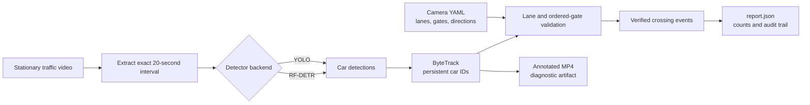

# CV Car Counter

An offline computer-vision tool that analyzes an exact 20-second interval from a stationary traffic camera and reports how many cars pass through configured roadway gates in each permitted travel direction.

The primary output is a **count plus auditable crossing events** (JSON). An annotated MP4 is a diagnostic artifact, not the source of truth.

## Pipeline



Each car is counted only after its tracked path crosses the configured gates in the permitted order and direction.

See [`.cursor/PLAN.md`](.cursor/PLAN.md) for the full design.

## Sample video

The sample clip is **not** stored in git. Download [Cars on Alley in City](https://www.pexels.com/video/cars-on-alley-in-city-13361265/) (Pexels, ~21.97 s, 1920×1080, 60 FPS) into `videos/`:

```bash
./scripts/download_sample_video.sh
```

That saves `videos/13361265-hd_1920_1080_60fps.mp4`. Pass `--force` to re-download. The default analysis interval is `[0s, 20s)`.

## Example output

YOLO on the sample clip (`[0s, 20s)`): **5 cars** counted (3 left-to-right, 2 right-to-left).

**Input** — canonical 20-second analysis clip: [example_output/input.mp4](example_output/input.mp4)

<video src="example_output/input.mp4" controls width="720" title="Canonical 20-second input clip"></video>

**Output** — annotated diagnostic video with boxes, track IDs, and trajectories: [example_output/output.mp4](example_output/output.mp4)

<video src="example_output/output.mp4" controls width="720" title="Annotated YOLO output"></video>

## Detector paths

Two interchangeable detector backends live under `src/cv_car_counter/detectors/`:

| Folder | Backend | License notes |
|---|---|---|
| `detectors/yolo/` | Ultralytics YOLO | AGPL-3.0 **or** a commercial Ultralytics Enterprise license. |
| `detectors/rfdtr/` | RF-DETR | Permissive checkpoint terms (verify the exact checkpoint you use). |

Exporting a model to ONNX does **not** change its original license. Pick the path that matches your distribution requirements before shipping.

## Install

The core package imports and its test suite run **without** any ML framework
installed — the heavy detector backends are optional extras. Pick the backend
that matches your license and Python version:

```bash
# Core only (imports + tests, no detector runs yet)
pip install -e .

# YOLO path — Ultralytics, requires torch. Use Python 3.12 or 3.13; torch may
# not yet have wheels for the very newest Python.
pip install -e ".[yolo]"

# RF-DETR path — permissive checkpoint terms. Use Python 3.12/3.13 (same
# torch constraint as YOLO). On Intel Mac / torch 2.2, the extra pins
# rfdetr 1.5.x so transformers 4.x still loads.
pip install -e ".[rfdtr]"
```

System requirements: `ffmpeg` and `ffprobe` on your `PATH` for clip transcoding/validation.

## Configure

Camera geometry is a versioned YAML file. A starter config for the Pexels clip ships at `configs/pexels_13361265.yaml` — open it in the calibration utility to draw lane polygons and ordered ENTRY/EXIT gates:

```bash
cv-car-calibrate --video videos/13361265-hd_1920_1080_60fps.mp4 --config configs/pexels_13361265.yaml
```

## Run

```bash
# YOLO path (default)
cv-car-counter \
  --video videos/13361265-hd_1920_1080_60fps.mp4 \
  --start 0 \
  --config configs/pexels_13361265.yaml \
  --detector yolo \
  --output outputs/run-001

# RF-DETR path
.venv-rfdtr/bin/cv-car-counter \
  --video videos/13361265-hd_1920_1080_60fps.mp4 \
  --start 0 \
  --config configs/pexels_13361265.yaml \
  --detector rfdtr \
  --output outputs/rfdtr-run
```

Outputs in the `--output` directory:

- `report.json` — the authoritative count, per-direction totals, and per-car crossing events.
- `clip.canonical.mp4` — the verified 20-second constant-frame-rate analysis clip.
- `clip.annotated.mp4` — diagnostic video with boxes, IDs, lane labels, and trajectories.

## Docker

The image bind-mounts host folders so clips and reports never live in the container:

| Host | Container | Purpose |
|---|---|---|
| `./videos` | `/videos` | source clips (read-only) |
| `./outputs` | `/outputs` | reports and annotated MP4s |
| `./configs` | `/configs` | camera YAML |
| `./weights` | `/models` | detector checkpoints (reused across runs) |

Download a clip into `videos/` first (`./scripts/download_sample_video.sh`). Then:

```bash
# YOLO (default). Writes to outputs/yolo-run on the host.
docker compose run --rm counter

# RF-DETR. Writes to outputs/rfdtr-run on the host.
docker compose --profile rfdtr run --rm rfdtr
```

Override any CLI flag after the service name. Paths inside the container must use the mount points above:

```bash
docker compose run --rm counter \
  --video /videos/13361265-hd_1920_1080_60fps.mp4 \
  --config /configs/pexels_13361265.yaml \
  --detector yolo \
  --weights /models/yolov8n.pt \
  --output /outputs/run-002
```

Or with plain `docker run` after `docker compose build`:

```bash
docker run --rm \
  -v "$(pwd)/videos:/videos:ro" \
  -v "$(pwd)/outputs:/outputs" \
  -v "$(pwd)/configs:/configs:ro" \
  -v "$(pwd)/weights:/models" \
  cv-car-counter:yolo \
  --video /videos/13361265-hd_1920_1080_60fps.mp4 \
  --config /configs/pexels_13361265.yaml \
  --output /outputs/yolo-run
```

The image is CPU-only (no CUDA wheel). Calibration (`cv-car-calibrate`) needs a display, so run that on the host rather than in Docker.

## Counting definition

A car is counted when **all** of the following are true:

1. It belongs to the configured `car` class and its road-contact point is inside a valid moving-lane polygon.
2. It has a confirmed, persistent track ID.
3. Its road-contact point crosses that lane's ENTRY gate and then its EXIT gate.
4. The traversal order and displacement match the lane's configured travel direction.
5. The EXIT-gate crossing timestamp falls within `[clip_start, clip_start + 20s)`.
6. The event is not a duplicate caused by an ID switch.

Parked cars, cross-traffic, wrong-way tracks, trucks, buses, and motorcycles are excluded by default. Cars already between the gates when the interval begins are **not** counted — their complete traversal cannot be proven.

## Tests

```bash
pip install -e ".[dev]"
pytest
```
